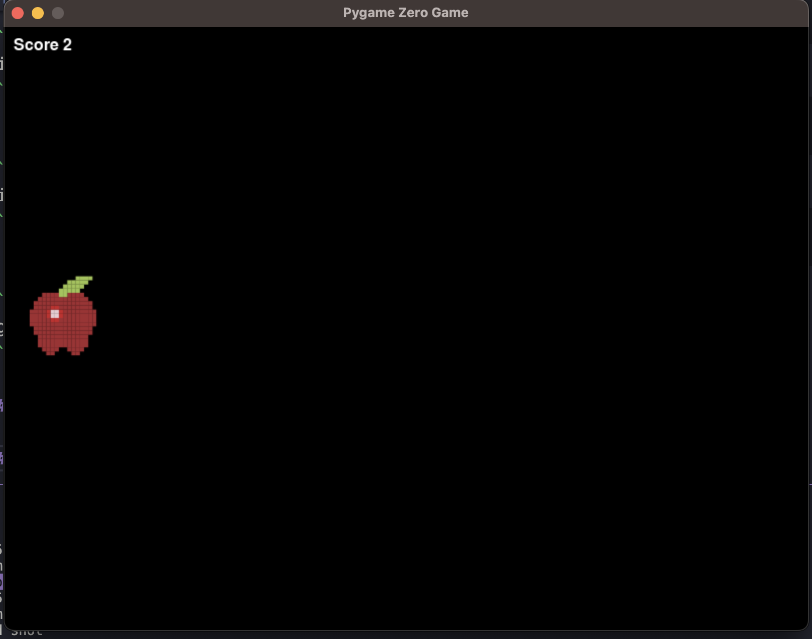
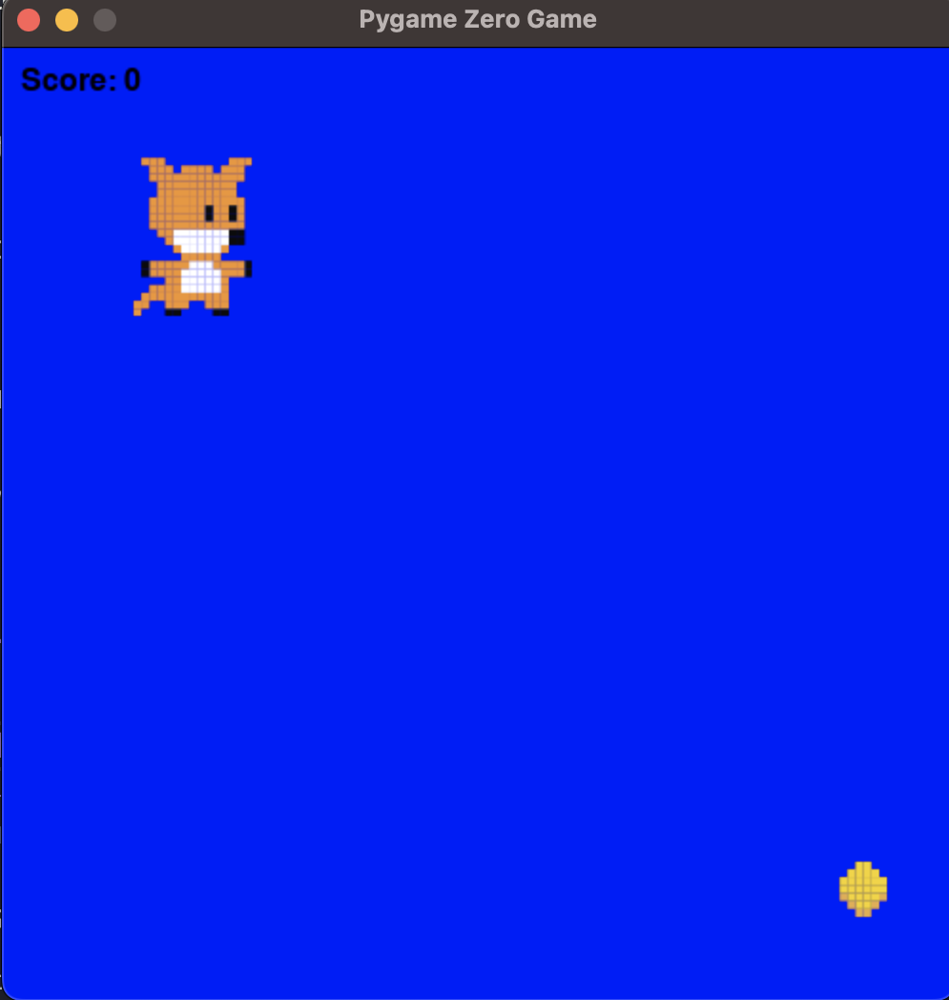
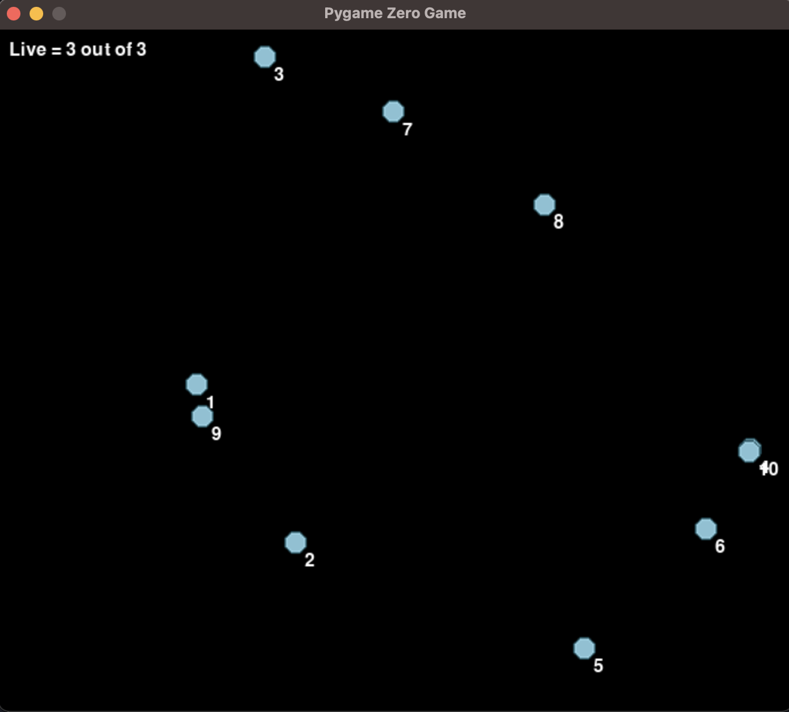
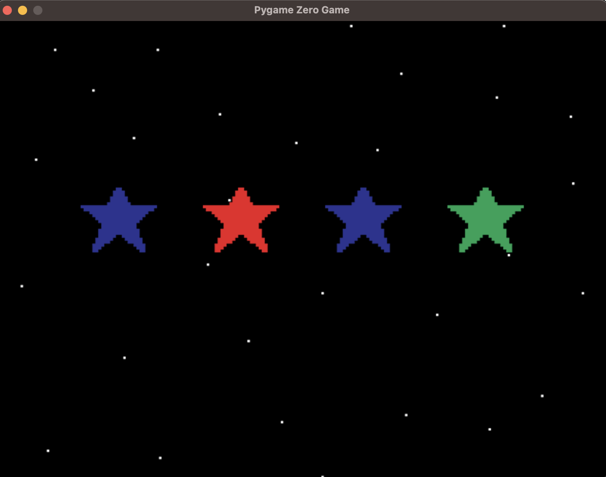
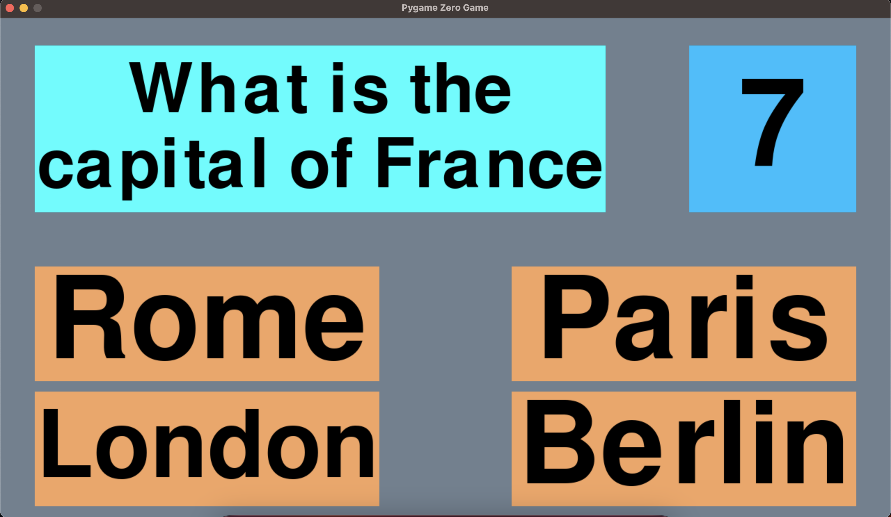
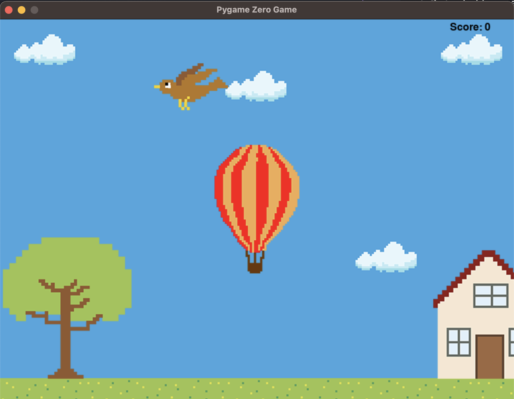
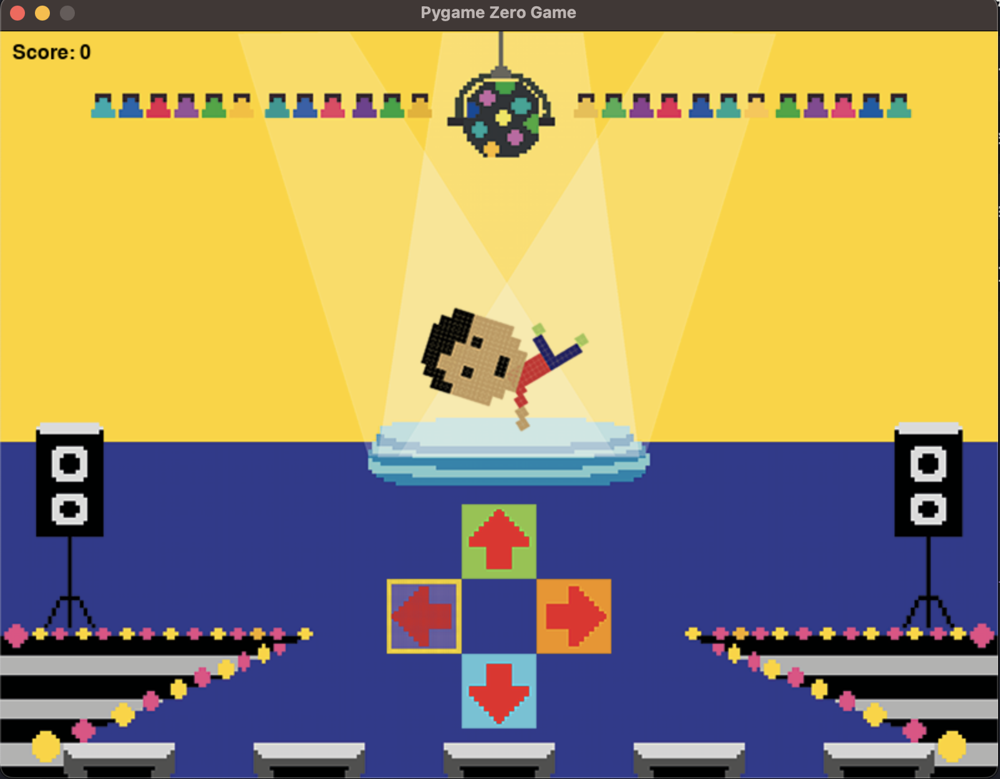

# Learning Python with games
Sami's personal projects
The games are from `Python games for kids` book, though i have improved on them

## How to use
- for all my fun games you need to have `python 3` installed.

- Install Pygame
```
pip3 install pygame
```

- Install Pygame zero
```
pip3 install pgzero
```

- To run on of the games
```
pgzrun PATH_TO_FILE.py_HERE
```

## Game list

### Shoot the fruit
In this game you have to use your mouse and click on the apple.



### Coin Collector
In coin collector you need to use the arrow keys to move and try to get the coins by making the fox touch the coin.



### Follow the numbers
Follow the number is a game where you use your mouse and click the circles with the number in the correct order. 



### Red alert
In Red alert you need to click on the red star before it reaches the ground (warning: each leval gets harder and harder)



### Big Quiz
Big Quiz is a game where you need to click on the correct answer but you only have ten seconds!



### Balloon Flight
Balloon flight is a similar game to flappy bird. You need to avoid all obstacles and use the mouse button to rise the balloon.


### Dance Challenge
In this game the dancer performs a sequence of moves. You need to remeber this sequence and make him repeat it by using the four arrow keys on the keyboard

